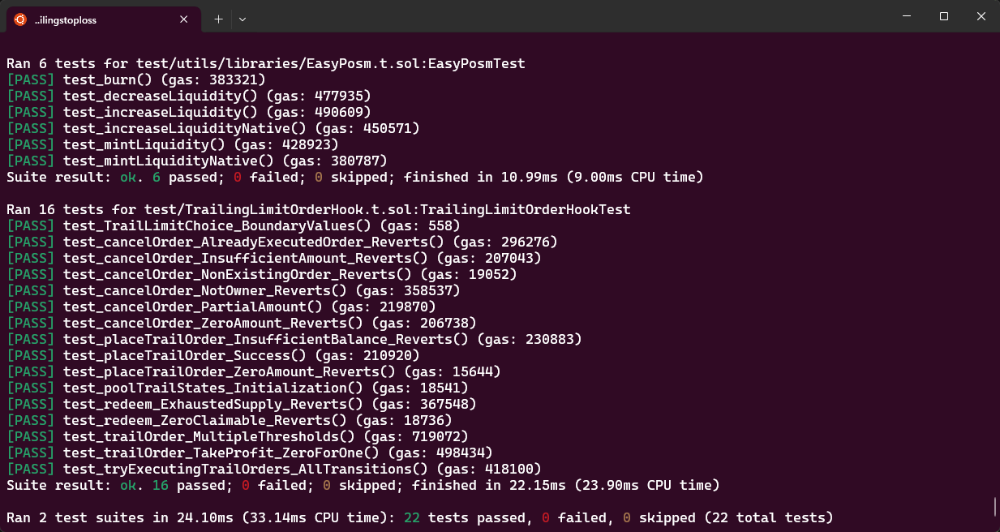

# Trailing Order Uniswap v4 Hook

**A simple hook to open positions and have them follow the trend, locking in profits 🐼**

With this hook, you can:

- Place trailing orders that adjust dynamically as price moves in your favor

- Automatically trigger execution once a configurable pullback threshold is hit

- Set expiry and direction (zeroForOne / oneForZero) for more controlled strategies


### Setup


```
foundryup
```

To set up the project, run the following commands in your terminal to install dependencies and run the tests:

```
forge install
forge test
```

### How it Works

How It Works (High-Level)

- The hook attaches to a Uniswap v4 pool and tracks price via ticks

- Users place a trail order specifying:

  - Amount
  - Trail configuration (e.g., 1%, 5%, 20% pullback)
  - Expiry time
  - Direction (zeroForOne or oneForZero)

 As price moves in favor of the order, the trailing reference updates. When price reverses by at least the configured trail distance, the order executes and locks in profits


### Next Steps/TODOs
- The trail pct/tick distance should vary depending on tick spacing of a pool
- Use keepers and callbacks to initiate user trades. This would keep gas costs normal for regular pool users. TrailOrder hook users could be charged a fee that would be used to offset keepers
- More granular control and ability to edit open orders (not just cancel)
- Integrate with a front-end


Thank you Atrium Academy and Uniswap Foundation! 💖